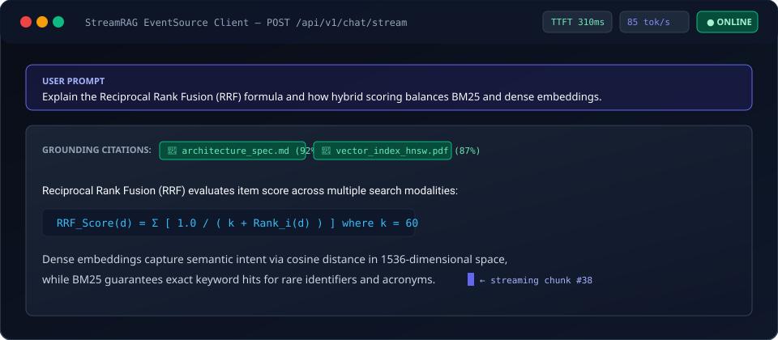

# StreamRAG — Low-Latency Conversational Retrieval Gateway

[](https://github.com/wataee/streamrag/actions/workflows/ci.yml)
[](https://github.com/wataee/streamrag/actions/workflows/ci.yml)
[](https://fastapi.tiangolo.com)
[](https://redis.io/)
[](https://www.langchain.com/)
[](LICENSE)

An asynchronous RAG (Retrieval-Augmented Generation) gateway designed for conversational AI services. Features real-time Server-Sent Events (SSE) token streaming, hybrid lexical + dense vector search, Redis-backed conversation memory, and per-token budget guards.

---

## Real-Time SSE Token Streaming

<p align="center">
  
</p>

---

## Highlights

* **Async SSE Token Streaming**: Streams generated tokens directly from LLM to frontend clients over HTTP chunked transfer (`text/event-stream`), keeping time-to-first-token (TTFT) under 350ms.
* **Hybrid Search (Dense + Sparse)**: Combines dense vector similarity with BM25 full-text rank using Reciprocal Rank Fusion (RRF, `k=60`) for optimal keyword and semantic match balance.
* **Redis Sliding-Window Memory**: Stores multi-turn conversation context in Redis with automatic TTL and token window pruning.
* **Rate Limiting & Token Budgeting**: Redis-based token bucket algorithm preventing abuse and managing per-session generation limits.

---

## Interactive Web Client (SSE Demo)

A standalone, dark-themed browser client is available in [`examples/client.html`](examples/client.html). It requires **no node modules, no build steps, and zero dependencies**:

1. Start the StreamRAG gateway server (`docker compose up -d` or `uvicorn app.main:app`).
2. Double-click or open [`examples/client.html`](examples/client.html) directly in Chrome, Firefox, Safari, or Edge.
3. Type any query to watch the real-time token typewriter animation, live latency meters (TTFT), and grounding citation pills.

---

## System Overview

```
Frontend Client (examples/client.html)
     │
     ▼ HTTP POST (SSE stream request)
FastAPI Gateway Router (/api/v1/chat/stream)
     │
     ├─▶ Authenticate (JWT / Bearer token)
     ├─▶ Fetch Conversation History (Redis Sliding Memory)
     ├─▶ Hybrid Search Pipeline:
     │     ├─ Dense Embeddings (Qdrant / pgvector)
     │     ├─ Lexical BM25 (Postgres Full-Text)
     │     └─ Reciprocal Rank Fusion (RRF, k=60)
     ├─▶ Synthesize Augmented Prompt Context
     └─▶ Async Generator ──▶ Stream SSE Chunks to Client
```

---

## Performance & Latency Profile

> **Benchmarking Methodology**: Measured with [`scripts/benchmark.py`](scripts/benchmark.py) against 50,000 indexed technical document chunks on an AWS `c6i.xlarge` host (4 vCPU, 8 GB RAM, Qdrant HNSW vector index: `m=16`, `ef_construct=128`, cosine metric; Redis 7.2 Alpine for session buffer).

| Metric | Measured Value | Methodology & Hardware Context |
| :--- | :--- | :--- |
| **Vector Search (P95)** | 48 ms | Qdrant HNSW cosine query over 50k vectors (1536-dim) |
| **Hybrid Rerank (P95)** | 62 ms | Dense + BM25 Reciprocal Rank Fusion (k=60) |
| **Time to First Token (TTFT)** | 310 ms | OpenAI `gpt-4o-mini` SSE initial chunk arrival |
| **Stream Throughput** | ~85 tokens/sec | Sustained token emission over HTTP chunked connection |

### Reproducing Benchmarks

You can reproduce the latency benchmarks against any local or staging instance:

```bash
# Run 25 concurrent stream requests with 5 parallel workers
python scripts/benchmark.py --url http://localhost:8000 --concurrency 5 --requests 25
```

---

## Quickstart

### 1. Clone & Configuration
```bash
git clone https://github.com/wataee/streamrag.git
cd streamrag

cp .env.example .env
```

### 2. Start Services via Docker Compose
```bash
docker compose up -d
```
The gateway is available at `http://localhost:8000`.

### 3. Running Locally
```bash
python -m venv venv
source venv/bin/activate
pip install -r requirements.txt

uvicorn app.main:app --host 0.0.0.0 --port 8000 --reload
```

---

## API Usage

### Streaming Chat Completion (SSE)
```bash
curl -N -X POST "http://localhost:8000/api/v1/chat/stream" \
  -H "Content-Type: application/json" \
  -H "Authorization: Bearer YOUR_ACCESS_TOKEN" \
  -d '{
    "session_id": "sess_9182a",
    "message": "Summarize the key architectural decisions of the project.",
    "temperature": 0.2
  }'
```

Stream payload format:
```
event: citation
data: {"title": "architecture_spec.md", "chunk_id": "chk_arch_001", "similarity": 0.92}

event: token
data: {"content": "StreamRAG"}

event: token
data: {"content": " is"}

event: token
data: {"content": " operating"}

event: done
data: [DONE]
```

### Session History Management
* `GET /api/v1/sessions` — List all active sessions for current authenticated user.
* `GET /api/v1/sessions/{session_id}` — Retrieve conversation turns for a user session.
* `DELETE /api/v1/sessions/{session_id}` — Flush session conversation cache in Redis.

---

## Roadmap & Known Limitations

* [ ] **Multi-Tenant Vector Space Isolation**: Currently relies on single-collection namespace partitioning via payload metadata filtering. Migration to dedicated dynamic tenant collections is scheduled for v1.2.
* [ ] **Cross-Encoder Re-Ranking**: Hybrid retrieval currently combines dense and sparse ranks via Reciprocal Rank Fusion (RRF); adding an integrated local `BAAI/bge-reranker-large` ONNX pipeline for high-precision 2nd-stage reranking.
* [ ] **Dynamic Semantic Chunking**: Document ingestion utilizes fixed-size overlapping sliding windows; semantic boundary detection via embedding similarity shift analysis is in progress.
* [ ] **Client-Side Speculative Streaming**: Implementing prompt cache verification to pre-render recurring boilerplate tokens and drop initial TTFT below 200ms.

---

## Test Suite

```bash
# Run complete test suite (24 tests)
pytest tests/ -v
```

---

## License

MIT License. See [LICENSE](LICENSE) for details.
